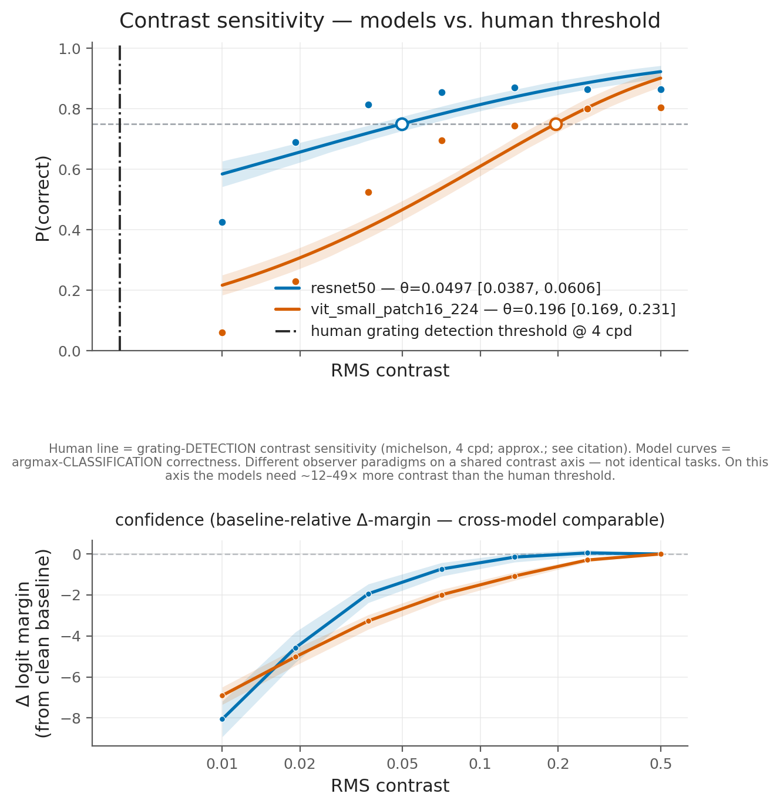
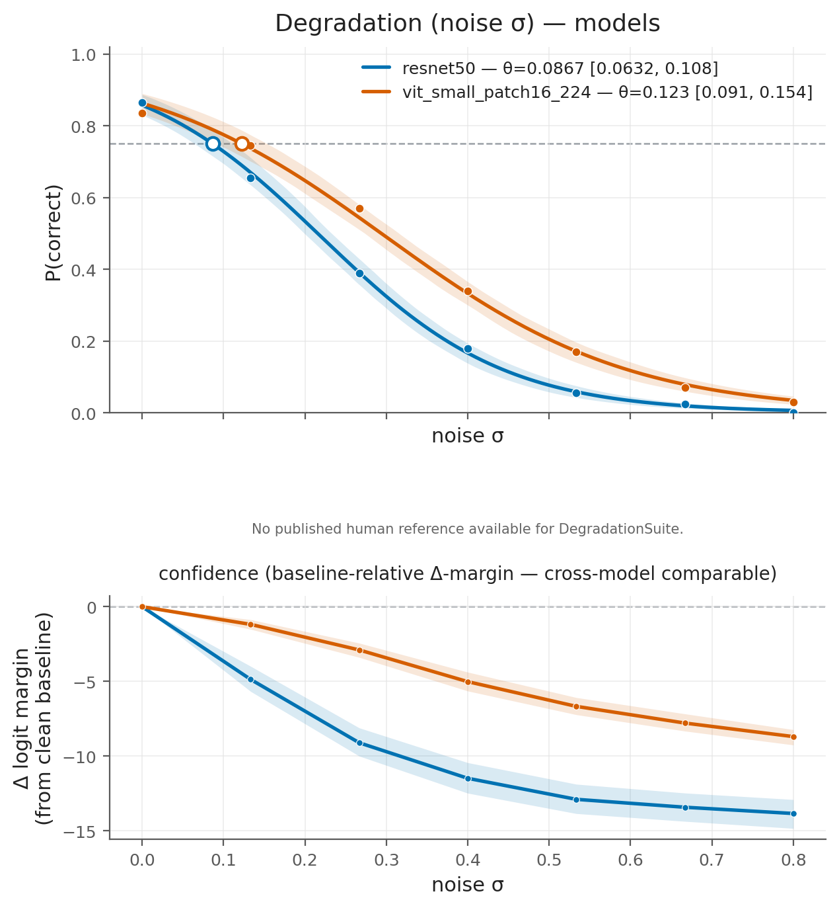
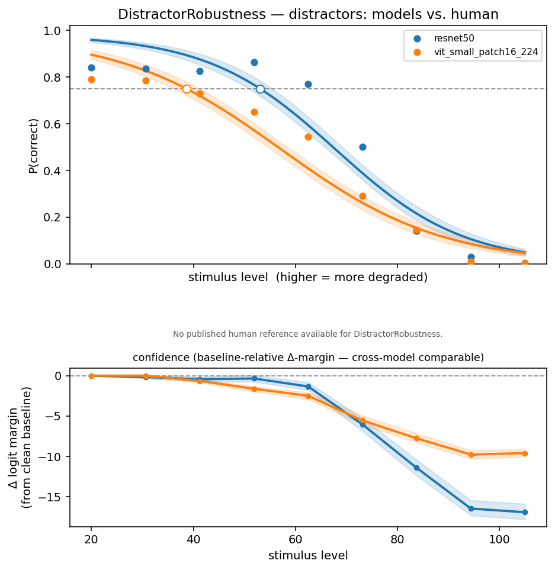
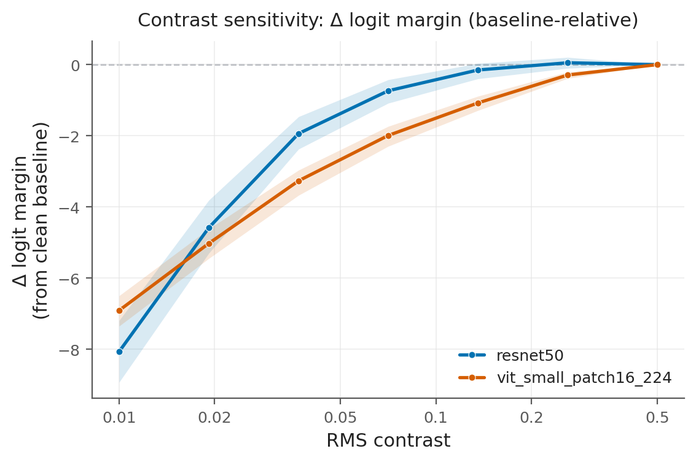

# psyvis-ml

**Why not just accuracy on corrupted images?** 

The usual robustness test (ImageNet-C and friends) gives you one number per corruption at one 
fixed severity. That tells you *that* a model degrades, but not the *shape* of the decline, 
the point where it breaks, or how steeply it falls off.

Two models can score the same accuracy at one severity and still have very different breaking
points. One might decline while the other falls sharply. A single number cannot tell them apart.

`psyvis-ml` treats a vision model like a subject in a vision experiment. It sweeps a stimulus
(contrast, noise, distractor size), fits a curve of P(correct) against the stimulus level, and
reads off a **threshold**, a **slope**, and a **confidence interval**. You get the curve, instead 
of a single point. That is a way to compare models fairly, and to place a model's sensitivity on 
the same axis as a human observer's.

## What this measures


### Threshold

Think of a classic pyschophysics visual experiment. Fade an image toward gray and watch when the 
model stops getting it right. The threshold is the contrast at which the model is correct ~75% of 
the time. It marks where the model's ability breaks down.

This is akin to calculating a detection threshold in human observers using the psychometric 
function.

A lower threshold means sharper vision. On real images, resnet50's contrast threshold (about
0.05) is lower than vit_small's (about 0.20), so resnet50 recognizes fainter images.

### The two models

The gallery compares two classifiers as two subjects.

resnet50 is a convolutional network. It is a classic design that scans the image with small
local filters.

vit_small is a Vision Transformer. It is a newer design that splits the image into patches and
lets the patches relate to each other. Two different ways of seeing, measured side by side.

### Confidence (logit margin)

The model scores every category. The margin is how far the winning score leads the runner-up.
A big margin means the model is confident. A small margin means it barely decided.

Accuracy only changes when the answer flips from right to wrong. The margin shows something
earlier: confidence eroding while the model is still correct but barely holding on. As an image
degrades, the margin shrinks before accuracy drops. That catches the "still correct but on the
edge" state that accuracy misses.

Margins are not compared as raw numbers across models. Different architectures use different
score scales, so a raw margin from resnet50 does not mean the same thing as one from vit_small.
This tool reports each model's change from its own clean baseline instead.

## What is shipped

This is early development. What works today:

- **Fitting core** (`psyvis_ml.fitting`): a small maximum-likelihood psychometric fitter. It is
  import-isolated, using only numpy and scipy.
- **Sweep engine** (`psyvis_ml.sweep`): method of constant stimuli with a reproducible run
  bundle (seed, config hash, library versions).
- **Three suites** (`psyvis_ml.suites`): contrast, degradation, and distractor-robustness.
- **`pe.measure(...)` API**: sweep, fit, then threshold, slope, CI, and plot.
- **Confidence-readout layer** (`psyvis_ml.confidence`): per-image logit-margin curves for every
  suite, baseline-relative change in margin, and a confidence threshold with bootstrap CIs, via
  `result.confidence(...)`.
- **Comparison, human overlays, and reports**: `result.compare(...)`, `result.report(...)`, and
  `psyvis_ml.reference`.
- **Per-item export** (`psyvis_ml.per_item`): the trial-level artifact — one row per
  (item × stimulus level × condition × model) with the signed logit margin and the correctness
  bit. See [Per-item data](#per-item-data-the-trial-level-artifact) and
  [`SCHEMA.md`](SCHEMA.md).
- **Results gallery** (`examples/generate_gallery.py`): standing figures plus `results.md`,
  `results.json`, `analysis.md` with paired bootstrap difference tests, and `per_item.csv`.

Still to come: more human-reference curves, adaptive staircases, Bayesian fitting, and
meta-d'/type-2 scoring.

## Per-item data (the trial-level artifact)

`results.json` is **aggregate**: per-level `(n_correct, n_trials)` counts and fits. That is
enough for a threshold, but not for anything that needs to pair a *confidence* with an
*outcome* trial by trial — meta-d′, type-2 ROC, folded confidence distributions. The sweep
already computes both (it sees the full logit vector per image per level), so a normal run now
also persists them:

```python
result = pe.measure(model=..., suite=..., dataset=..., levels=...)
export = result.write_per_item("outdir")     # outdir/per_item.csv + per_item.meta.json
table  = pe.load_per_item(export.data_path)  # or just pandas.read_csv — it is a plain file
```

The file is written automatically by `result.report(...)` and by the gallery. It is
**additive**: the aggregate outputs are unchanged.

The persisted `margin` is `logit[true_label] − max(logit[others])`, kept **signed**, with its
decision boundary at **0** (`margin > 0` iff the true label is top-1). psyvis-ml never applies
`abs()` on export — folding the margin into an unsigned confidence is a *scoring* decision for
the consumer, and the signed value keeps both the magnitude and the direction of evidence
recoverable. Full column-by-column contract: [`SCHEMA.md`](SCHEMA.md).

## Install

```bash
pip install -e .            # core: numpy, scipy, matplotlib
pip install -e ".[demo]"    # adds torch, timm, Pillow for the real-model demos
pip install -e ".[dev]"     # adds pytest, ruff
```

`import psyvis_ml` and the whole fitting and measurement path run on the core dependencies
alone. torch, timm, and Pillow load lazily, only when you call the real-model helpers.

## Quickstart: the human-vs-models figure

The worked example ([`examples/worked_example.ipynb`](examples/worked_example.ipynb)) runs the
whole instrument on real models. It loads a few `timm` ImageNet classifiers, sweeps contrast,
fits, and draws the human-vs-models figure with the cited human CSF overlay.

**You supply the images.** This package never bundles or downloads ImageNet. Point it at your
own subset in ImageFolder layout (`<root>/<class>/img.JPEG`, with class folders named by integer
ImageNet index or WordNet ID).

```bash
pip install -e ".[demo]"
export IMAGENET_DIR=/path/to/your/imagenet_subset   # your own data
jupyter notebook examples/worked_example.ipynb
```

In code the same path is a few lines:

```python
import psyvis_ml as pe

ds = pe.datasets.imagenet_subset("/path/to/your/imagenet_subset", max_classes=5)
models = {n: pe.models.timm_classifier(n) for n in ["resnet18", "resnet50"]}  # frozen, eval
suite = pe.suites.ContrastThreshold(contrast_metric="rms", clip_range=(0.0, 1.0))
levels = pe.linspace_levels(0.01, 0.5, 9, spacing="log")

results = [pe.measure(model=m, suite=suite, dataset=ds, levels=levels, model_name=n)
           for n, m in models.items()]
fig = results[0].compare(results[1:], human="auto")   # models + cited human CSF on one axis
results[0].report(others=results[1:], outdir="report_bundle")   # methods-ready bundle
```

`model` is just a callable `image -> logits`. `timm_classifier` is a convenience wrapper, not a
requirement. Any framework, or a plain function, works.

## Results gallery

Standing figures on real **Imagenette** val (resnet50 and `vit_small_patch16_224`), regenerated
by [`examples/generate_gallery.py`](examples/generate_gallery.py) into
[`outputs/gallery/`](outputs/gallery/). Numbers live in
[`results.md`](outputs/gallery/results.md), [`results.json`](outputs/gallery/results.json), and
[`analysis.md`](outputs/gallery/analysis.md).

**Contrast: human vs. models (lead figure).**



> **Paradigm caveat, read with the figure.** The human line is *grating-detection* contrast
> sensitivity (Campbell & Robson 1968, Michelson contrast). The model curves are
> *argmax-classification* correctness on natural images (RMS contrast). These are different
> observer paradigms on a shared contrast axis. A model threshold far from the human line is a
> difference in task, not proof that a model does or does not "see like" a human.

**Degradation (gaussian noise): fitted falling curves plus the margin readout.**



**Distractor robustness: sweep distractor size for a real threshold.** A big centred target
(large enough to clear the recognition ceiling) is surrounded by distractors which are swept 
with increasing size from the margins. Performance falls as distractor size grows, giving a 
real, non-extrapolated threshold: the distractor size at criterion, with the size band set by `calibrate_distractor_size`.



**Confidence layer: change in logit margin from the clean baseline (contrast).** The primary
confidence signal is the target-class logit margin, not softmax. Across models it is compared
only as change from each model's own clean baseline.



Regenerate locally. You supply the data, nothing is bundled or downloaded.

```bash
pip install -e ".[demo]"
export PSYVIS_IMAGENET_DIR=/path/to/imagenette2/val
python examples/generate_gallery.py
```

## The fitting core

`psyvis_ml.fitting` is a small, self-contained maximum-likelihood fitter for the psychometric
function. It is import-isolated: it imports only numpy and scipy, and nothing else from the
package, because sibling projects reuse it.

You can point it at any `(stimulus_level, n_correct, n_trials)` data:

```python
import numpy as np
from psyvis_ml.fitting import fit_psychometric

levels    = np.array([0.02, 0.04, 0.08, 0.16, 0.32])   # e.g. RMS contrast
n_correct = np.array([  12,   19,   34,   46,   49])
n_trials  = np.array([  50,   50,   50,   50,   50])

fit = fit_psychometric(levels, n_correct, n_trials, sigmoid="weibull",
                       guess_rate=0.5, lapse_rate=0.02)

fit.threshold(target=0.75)          # stimulus level at 75% correct
fit.slope(target=0.75)              # dP/dx there (units="linear" | "log", base=10 for log10)
fit.bootstrap_ci("threshold", target=0.75, seed=0)   # percentile CI
fit.summary()                       # flat dict of everything, incl. at_bound
```

The model is

```
P(correct | x) = γ + (1 − γ − λ) · F(x; α, β)
```

`F` is a Weibull or logistic sigmoid with location `α` (stored as `params["alpha"]`) and slope
`β` (`params["slope"]`). `γ` is the guess rate (lower asymptote) and `λ` is the lapse rate
(upper asymptote).

Note that `params["alpha"]` (the raw sigmoid location) and `fit.threshold(target)` (the derived
stimulus level at a given performance) are different. The latter is usually what you report.

Pass a number to hold `guess_rate` or `lapse_rate` fixed, or `None` to estimate it by maximum
likelihood (`λ` bounded to `[0, 0.5)`, `γ` to `[0, 1)`). The default lapse is a fixed
`λ = 0.02`.

### Methods note: the fitter is observer-model-agnostic

This fitting core makes no assumption about how "correct" is defined. It consumes only the
aggregated `(level, n_correct, n_trials)` counts.

The decision to score a model by argmax top-1 correctness happens in the measurement suites, not
here. It is a documented, swappable observer-model choice, not a limitation of the fitter. Other
observer models (top-k, a trained contrast-discrimination probe, a 2AFC pairing, a
softmax-confidence criterion) produce the same count shape and fit identically.

I name this because the closest prior art measures a different observer:
[Akbarinia et al. (2023), *Contrast Sensitivity Function in Deep Networks*](https://pubmed.ncbi.nlm.nih.gov/37156217/)
measures DNN CSFs with a trained linear contrast-discrimination probe on frozen features, rather
than argmax top-1 on a labeled classification set. That is an entirely different observer model
than this.

## Comparison, human overlays, and the report bundle

Once you have measured several models, `result.compare([other_a, other_b, ...])` puts their
psychometric curves on one axis for a shared suite and condition. Each curve shows observed
points, the fitted curve, its threshold, and a CI band.

Comparison honors each result's declared axis direction (rising for contrast, falling for
degradation and distractor size). It refuses to overlay results from mismatched suites or
conditions rather than compare apples to oranges.

Where a credible published human curve exists, the same axis carries a cited human overlay. We
ship pre-collected, published human sensitivity data as static, versioned reference data, and we
never run human experiments or synthesize a curve. Where no good human data exists (distractor
robustness, for example, which has no established human sensitivity curve), the overlay degrades
to models only, with a note, instead of fabricating one.

Shipped human reference data lives in `psyvis_ml.reference`, with files under `reference/data/`:

- **Contrast sensitivity function**: an approximate, digitized human photopic CSF for sinusoidal
  gratings (Michelson contrast). It is representative of the classic band-pass curve of
  **Campbell, F. W., & Robson, J. G. (1968). Application of Fourier analysis to the visibility
  of gratings. _The Journal of Physiology_, 197(3), 551-566.**
  ([doi:10.1113/jphysiol.1968.sp008574](https://doi.org/10.1113/jphysiol.1968.sp008574)), and
  consistent with the ModelFest and standard-observer literature. It is flagged `approximate` in
  both the data file and the API. It is for illustration and cross-checking, not a substitute
  for measuring your own observers, and its contrast metric (Michelson grating) may differ from
  a given model dataset's.

`result.report(others=[...])` writes a self-contained methods bundle. It includes a
threshold/slope/CI table, the fitted-curve figures, the models-vs-human comparison figure, and
the reproducibility metadata captured in every run (resolved seed, config hash, library
version). You can drop it straight into a methods section or archive it as an audit bundle.

### Relationship to existing tools

For fitting human observer data, [**psignifit 4**](https://psignifit.readthedocs.io/en/latest/)
is the gold standard (Bayesian beta-binomial, goodness-of-fit, CIs). `psyvis-ml` is not a
replacement. This fitter is deliberately small and dependency-light so it can be embedded in a
model-evaluation harness, and interoperating with psignifit for cross-checking fits is an
explicit later goal.

`psyvis-ml` is a reproducible sweep engine, a set of measurement suites, and human-reference 
overlays that point this machinery at models. No existing tool packages parametric 
threshold-and-slope psychophysics as a reusable instrument pointed at off-the-shelf vision 
models. The confidence-decline readout (fitting logit-margin erosion as its own curve 
alongside accuracy) is underexplored.

## License

MIT. See [LICENSE](LICENSE).
